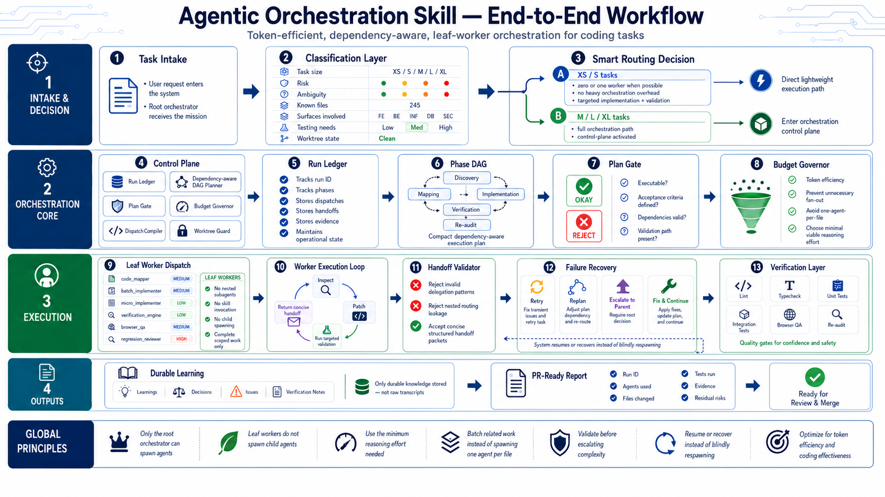

# Agentic Orchestration Control

<p align="center">
  
</p>

<p align="center">
  <em>Explicit-only, npm/npx control room for Codex orchestration runs.</em>
</p>

<p align="center">
  <a href="https://github.com/ZypherHQ/agent-orchestration-skill">
    
  </a>
  <a href="LICENSE">
    
  </a>
</p>

Agentic Orchestration Control packages an explicit Codex orchestration skill, leaf-worker subagent profiles, run ledgers, usage reports, and realtime TUI/GUI views behind one npm CLI. State is written to `.orchestration/`; the TUI and GUI read the run ledger as it changes.

## Quick Start

Install the skill pack into a target repo:

```bash
npx --yes agentic-orchestration-control install /path/to/repo
```

Start a run ledger in that repo:

```bash
npx --yes agentic-orchestration-control init \
  --repo /path/to/repo \
  --run-id latest \
  --task "ship checkout fix"
```

Open the realtime terminal UI:

```bash
npx --yes agentic-orchestration-control --repo /path/to/repo --run-id latest
```

Open the realtime local GUI:

```bash
npx --yes agentic-orchestration-control gui --repo /path/to/repo --run-id latest
```

Use the explicit skill only when you want the orchestration workflow:

```text
Use $agent-orchestration-skill for this task.

Run in token-efficient control-plane mode.
Spawn only useful leaf workers.
Preserve context with a scoped Context Capsule.
```

Prompts without the exact literal `$agent-orchestration-skill` should run in normal Codex mode.

> Note: You need `npm` to fetch/run the CLI. The routed control-room utilities also call bundled Python scripts, so `python3` must be on `PATH` for TUI, GUI, usage, gates, memory, and validation commands.

## Installed Layout

`install` writes the supported layout into the target repo:

```text
skills/agent-orchestration-skill/
subagents/
.orchestration/bin/aoc
AGENTS.md
```

Legacy hidden layouts such as `.skills/`, `.agents/skills/agent-orchestration-skill`, and `.codex/agents` are backed up under `.orchestration-backup-*` when they contain payload.

## Common Commands

Run commands with `npx`, or use the `aoc` alias after local/global installation:

```bash
npx --yes agentic-orchestration-control install /path/to/repo
npx --yes agentic-orchestration-control init --repo /path/to/repo --run-id latest --task "smoke"
npx --yes agentic-orchestration-control --repo /path/to/repo --run-id latest
npx --yes agentic-orchestration-control gui --repo /path/to/repo --run-id latest
npx --yes agentic-orchestration-control usage --repo /path/to/repo --run-id latest
npx --yes agentic-orchestration-control budget 12000 --repo /path/to/repo --run-id latest
npx --yes agentic-orchestration-control gates --repo /path/to/repo
npx --yes agentic-orchestration-control memory build --repo /path/to/repo --run-id latest
aoc --repo /path/to/repo --run-id latest
aoc gui --repo /path/to/repo --run-id latest
```

## Snapshot Modes

Use snapshots in CI, tests, logs, or non-interactive shells.

Print a deterministic TUI snapshot:

```bash
npx --yes agentic-orchestration-control snapshot --repo /path/to/repo --run-id latest
```

Render one HTML GUI snapshot and exit:

```bash
npx --yes agentic-orchestration-control gui \
  --repo /path/to/repo \
  --run-id latest \
  --once > /tmp/aoc.html
```

## Remote GUI Access

The GUI binds locally by default. Expose it remotely only with an explicit token:

```bash
AOC_GUI_TOKEN="change-me" \
  npx --yes agentic-orchestration-control gui \
  --repo /path/to/repo \
  --run-id latest \
  --host 0.0.0.0 \
  --allow-remote \
  --auth-token "$AOC_GUI_TOKEN"
```

## Runtime State

Runs write local state under the target repo:

```text
.orchestration/runs/<run_id>/
.orchestration/events.jsonl
.orchestration/usage/
.orchestration/memory/
```

The TUI and GUI read this state. They do not need mock data or a remote service.

## What Is Enforced

The package includes real validators and command-level checks for install layout, publish readiness, TUI/GUI snapshots, run ledgers, usage budgets, STOP gate state, context coverage, and handoff shape.

Some orchestration boundaries are policy-driven because Codex prompts and spawned workers are outside the package runtime. The skill, installed `AGENTS.md`, subagent profiles, validators, and docs all require explicit activation, root-only orchestration, scoped worker dispatches, and leaf-worker behavior, but they cannot make an arbitrary model session obey those rules without the user and agent following the contract.

Usage reporting also separates imported/recorded real usage from estimated orchestration pressure. Estimated pressure is a local signal, not provider billing.

## Development

Install dependencies and run checks:

```bash
npm install
npm test
npm run test:npm-cli
npm run publish:check
npm run validate:production
```

Dry-run the package payload, then publish when validation passes:

```bash
npm pack --dry-run
npm publish
```

## More Docs

Start with [docs/README.md](docs/README.md) for setup, usage examples, repo map, quality notes, security model, and contributor-sized PR candidates.

## License

MIT License. See [LICENSE](LICENSE).
